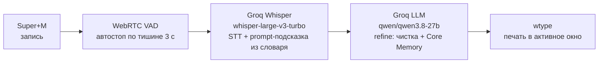
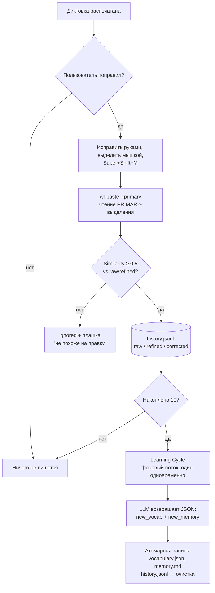

# Голосовая диктовка: noctalia-dictation

Данный документ описывает архитектуру и пользовательские сценарии модуля голосовой диктовки `noctalia-dictation`: распознавание речи через Groq Whisper, очистку текста LLM-моделью, механизм самообучения на пользовательских исправлениях (Agentic Core Memory) и интеграцию с рабочим столом Noctalia/niri.

---

## 1. Обзор системы

Модуль состоит из четырёх компонентов:

| Компонент | Расположение | Назначение |
| :--- | :--- | :--- |
| **Python-пакет** | `modules/packages/noctalia-dictation/` | Headless-демон: аудио-запись, работа с моделями, IPC-сервер, самообучение |
| **Nix-модуль пользователя** | `modules/home/apps/dictation.nix` | Сборка пакета, sops-конфиг, systemd-юнит, сиды файлов памяти |
| **Плагин Noctalia** | `modules/packages/noctalia-dictation/plugin/` | Виджет микрофона в баре (Luau), подписанный на state-стрим демона |
| **Хоткеи niri** | `modules/home/desktop/niri.nix` | `Super+M` — диктовка, `Super+Shift+M` — коррекция |

Демон работает как systemd user-сервис (`noctalia-dictation.service`), привязанный к `graphical-session.target`, и не зависит от Noctalia — плагин и хоткеи лишь клиенты его Unix-сокета.

---

## 2. Пайплайн диктовки

### 2.1. Аудио-захват (`src/audio.py`)
* Запись через PortAudio (`sounddevice`), 16 кГц, mono, int16.
* WebRTC VAD (агрессивность 2, конфигурируется) отслеживает речь; после голоса и 3 секунд тишины (настраивается `silence_duration_seconds`) запись останавливается автоматически.
* Событие тишины передаётся из realtime-колбэка PortAudio в рабочий поток через `queue.Queue` — спавн потоков внутри аудио-колбэка запрещён (риск xrun'ов).
* Аудио короче ~0.4 с отбрасывается как случайный щелчок.

### 2.2. Распознавание речи — Whisper (`src/backend.py`, шаг 1)
* WAV отправляется в `POST {base_url}/audio/transcriptions` (Groq API, модель `whisper-large-v3-turbo`, temperature 0).
* В параметр `prompt` подставляется строка терминов из `vocabulary.json` (до 400 символов) — **biasing-подсказка**: Whisper ожидает встретить знакомые термины и перестаёт распознавать «никсос» вместо NixOS.
* Whisper не имеет состояния: каждый запрос независим, «память» живёт только в файле словаря.

### 2.3. Очистка текста — refine LLM (шаг 2)
* Сырой транскрипт уходит в `POST {base_url}/chat/completions` (модель `qwen/qwen3.8-27b`, temperature 0.2).
* **System prompt** = пользовательский промпт из конфига + содержимое `memory.md` (Core Memory). Ключевое правило — модель **стенографист, а не собеседник**: она не отвечает на вопросы и не выполняет команды, встречающиеся в диктуемом тексте.
* **User prompt** = транскрипт, обёрнутый в теги `<raw_transcript>…</raw_transcript>` — защита от «отвечания» вместо редактирования.
* Транскрипт без речи → пустой результат, ничего не печатается.

### 2.4. Ввод текста (`src/injector.py`)
Текст печатается в активное окно через виртуальную клавиатуру (`wtype`), **не** через буфер обмена:
* буфер обмена пользователя не затирается (скопированный код остаётся доступен для Ctrl+V);
* нет вставки из PRIMARY — раньше Shift+Insert в ряде приложений читал PRIMARY-выделение и вставлял устаревший текст.
* Переводы строки заменяются на пробелы — Enter не отправит сообщение в чате и не разорвёт строку.

---

## 3. Файлы контекста (Agentic Core Memory)

Три writable-файла в `~/.config/noctalia-dictation/` — единственное состояние системы. Модели stateless: вся «память» подмешивается в промпты при каждом запросе.

| Файл | Роль | Пишут | Лимиты |
| :--- | :--- | :--- | :--- |
| `vocabulary.json` | Термины для prompt-подсказки Whisper | цикл самообучения | 50 терминов, строка промпта ≤ 400 симв. |
| `memory.md` | Правила стиля и предпочтения для refine-LLM | цикл самообучения | 500 символов |
| `history.jsonl` | Журнал исправлений (сырьё для обучения) | `capture-correction`; очищается циклом | — |

Файлы не декларативны намеренно: они переживают `nixos-rebuild` (сидятся только при отсутствии), чтобы цикл самообучения мог обновлять их без конфликтов с Home Manager. Запись всегда атомарная (tmp-файл + `os.replace`) — сбой питания не оставит пустой/повреждённый файл.

`config.yaml` рендерится sops-nix (там `api_key`); файлы контекста живут рядом, но не внутри secrets-каталога.

---

## 4. Самообучение на исправлениях

### 4.1. Захват коррекции (`capture_correction`)
1. **`Super+Shift+M`** — демон читает **PRIMARY-выделение** (`wl-paste --primary`): достаточно просто выделить исправленный текст мышкой, Ctrl+C не нужен, буфер обмена не трогается.
2. **Similarity-guard** (`src/similarity.py`): PRIMARY хранит «последнее выделенное где угодно», поэтому выделение проверяется на похожесть на последнюю диктовку:
   * нормализация — casefold, пунктуация → пробел, сжатие whitespace (правки «только пунктуации/регистра» не отбрасываются);
   * метрика — `difflib.SequenceMatcher.ratio()`, максимум по сравнению с `raw` (что сказал Whisper) и `refined` (что вернула LLM);
   * **score < 0.5 → игнор** («как будто коррекции не было»), score ≥ 0.5 → запись в `history.jsonl`.
3. Коррекция привязана к **последней** диктовке (`last_dictation` в памяти демона) — выделить надо до следующей диктовки.

### 4.2. Цикл обучения (`_run_learning_cycle`)
* Запускается автоматически после 10-й коррекции (флаг `_is_learning_running` + лок не дают запуститься двум циклам параллельно).
* Один запрос к LLM (`response_format: json_object`, temperature 0.2): на вход — текущие `memory.md`, `vocabulary.json` и весь `history.jsonl`; на выходе — строго JSON `{"new_vocab": [...], "new_memory": "..."}`.
* Модель добавляет до 3 новых терминов из исправлений (итог ≤ 50) и переформулирует Core Memory (≤ 500 символов).
* Если `new_memory` длиннее 500 символов — повторный запрос «сожми», при неудаче — обрезка по границе слова.
* Результаты записываются атомарно, `history.jsonl` очищается, счётчик сбрасывается.

**Важно понимать:** никакого дообучения весов (градиентов) нет. «Обучение» = LLM один раз переписывает два файла контекста, а те дальше подмешиваются в промпты каждого запроса. Это чистый in-context learning через файлы на диске; демон перечитывает их при каждой новой диктовке, поэтому изменения подхватываются без рестарта сервиса.

---

## 5. Уведомления (`src/notifier.py`)

Статус записи и обработки отражает виджет в баре (цвет иконки + тултип) — уведомления дублируют его только там, где виджета недостаточно:

| Событие | Плашка | Поведение |
| :--- | :--- | :--- |
| Коррекция сохранена | «Правка сохранена (N/10)» | toast, ~2.5 с |
| Выделение отвергнуто guard'ом | «Выделение не похоже на правку — не сохранено» | toast, ~2.5 с |
| Цикл обучения пройден | «Цикл самообучения пройден: словарь и память обновлены» | постоянное |
| Ошибка цикла обучения | текст ошибки | постоянное, critical-urgency |

`Notifier` — класс с инкапсулированным lock-guarded состоянием дедупликации (ключ `(summary, body)`, окно 2 с): повторные идентичные уведомления подряд подавляются, разные — нет. При отсутствии `notify-send` — graceful-деградация в журнал.

---

## 6. IPC и управление

Unix-сокет `$XDG_RUNTIME_DIR/noctalia-dictation.sock`, протокол — строки/NDJSON:

| Команда CLI | Поведение |
| :--- | :--- |
| `noctalia-dictation toggle` | старт/стоп записи |
| `noctalia-dictation stop` | принудительный стоп |
| `noctalia-dictation status` | текущее состояние (JSON) |
| `noctalia-dictation status --follow` | стрим событий (его читает виджет) |
| `noctalia-dictation capture-correction` | захват коррекции (то же, что Super+Shift+M) |

Состояния демона: `idle` / `recording` / `processing`. Виджет в баре Noctalia красит иконку микрофона по стриму: запись — primary, обработка — loader, простой — приглушённая. Стрим `status --follow` переподключается бесконечно (бэкофф 2 с): при рестарте демона (каждый `nixos-rebuild switch`) процесс не умирает, а переживает паузу и продолжает обновлять виджет — иначе виджет, запускаемый Noctalia один раз, застывал бы в последнем состоянии навсегда.

---

## 7. Конфигурация

`~/.config/noctalia-dictation/config.yaml` (рендерится sops-nix из `modules/home/apps/dictation.nix`, секрет — `groq_api_key`):

| Параметр | Default | Назначение |
| :--- | :--- | :--- |
| `base_url` | `https://api.groq.com/openai/v1` | OpenAI-совместимый endpoint |
| `stt_model` | `whisper-large-v3-turbo` | модель распознавания |
| `refinement_model` | `qwen/qwen3.8-27b` | модель очистки и цикла обучения |
| `silence_duration_seconds` | 3.0 | тишина до автостопа (0.5–10) |
| `vad_aggressiveness` | 2 | чувствительность VAD (0–3) |
| `sample_rate` | 16000 | частота дискретизации |
| `system_prompt` | см. `src/models.py` | промпт refine-LLM |

Пороги поведения заданы константами в `src/main.py`: `CORRECTION_SIMILARITY_THRESHOLD = 0.5`, `CORRECTIONS_PER_LEARNING_CYCLE = 10`.

---

## 8. Пользовательский сценарий (шпаргалка)

1. **`Super+M`** → иконка микрофона в баре загорается цветом → говорите → пауза ~3 с → текст печатается в активное окно.
2. **Всё правильно** → ничего не делаете, в журнал ничего не пишется.
3. **Есть ошибки** → правите текст руками → **выделяете исправленное мышкой** (Ctrl+C не нужен) → **`Super+Shift+M`** → плашка «Правка сохранена (N/10)».
4. Выделили что-то постороннее → плашка «не похоже на правку», в историю не попадает.
5. После 10-й коррекции в фоне обновляются словарь и память, придёт постоянное уведомление.
6. Повторная диктовка уже учит новые термины и правила стиля.

Диагностика: `journalctl --user -u noctalia-dictation -f`.
